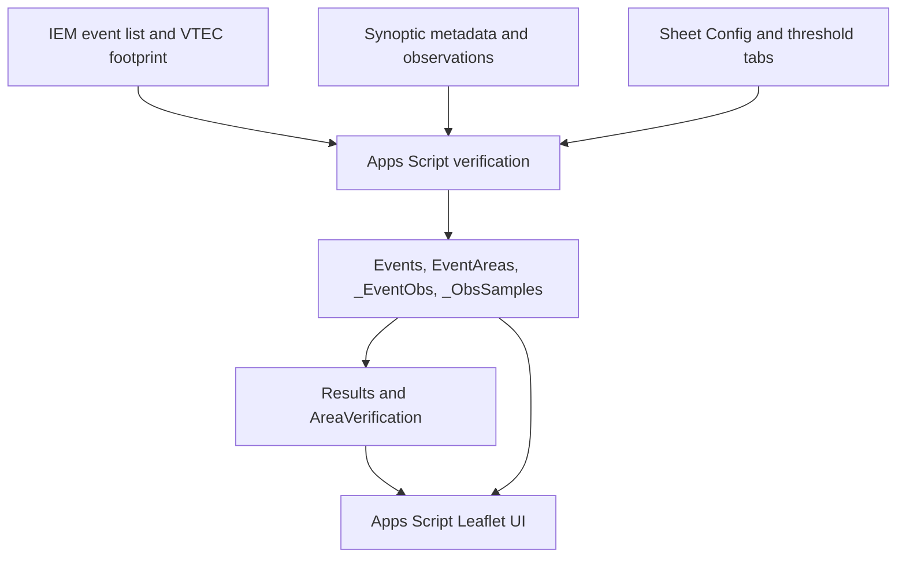

# Architecture and data flow

The existing Apps Script/Sheets structure is retained. No standalone server, database migration, GitHub Pages replacement, or paid infrastructure was introduced.

## Run flow

`runMonthlyWeb(month, year)` or `runAnnualWeb(year)` creates a UTC query range. The corresponding menu functions prompt in the Sheet. All mutation entry points use one script lock; internal unlocked calls avoid nesting locks. `validateRuntimeSchema_` checks populated runtime-table headers before a run or rebuild.

1. Read Config, preferred Script Properties, and threshold maps. Resolve the existing runtime Sheet through `SPREADSHEET_ID` or the active bound spreadsheet.
2. Refresh Synoptic metadata for the configured CWA, keeping inactive stations eligible for historical data.
3. Fetch the IEM annual event list and select supported warning events overlapping the requested period. Group by hazard, phenomenon, and ETN. Keys include year, WFO, hazard, phenomenon, ETN, and first issue timestamp.
4. Fetch the event GeoJSON; combine UGC identifiers with event-row timing when exposed. GeoJSON-only UGCs get event-wide timing explicitly marked as fallback. No polygons are persisted in Sheets.
5. Select stations using exact normalized public forecast-zone UGC matches, matching CWA and applicable rules. Missing footprints do not select the whole CWA. County UGCs are preserved but cannot be matched to station public-zone metadata without an additional crosswalk.
6. Reuse completed summaries/samples only when expiry, warned UGCs, and the calculation fingerprint match, at least one summary exists, the event ended over an hour ago, and forced refresh is off.
7. Otherwise fetch time series in groups of 60 station IDs. Retain samples within station warning windows, select the first preferred observation sensor array, apply physical range guards, calculate Heat Index/wind chill/dewpoint, and evaluate criteria. Aggregate extrema, sample counts, coverage, and duration in memory.
8. Invalidate old completion markers before fresh writes. Replace only requested event keys in raw tables while retaining other keys. Publish event metadata after sample/summary persistence. Rebuild all Results and AreaVerification from retained history.

## UI flow

`doGet` serves Index. `getVerificationMapPayload` loads all events, Results, area summaries, and analytics. Polygons are fetched only for the selected event through `getEventFootprintPayload`. Timeline samples are requested by event through `getEventTimelinePayload`; the backend currently reads the full sample sheet then filters it. The frontend groups native samples into five-minute bins; the latest sample encountered per station/bin wins. Colors in timeline mode represent instantaneous criteria, not the final duration-qualified status.

Leaflet uses OpenStreetMap tiles. An ArcGIS county/parish layer is background context only; it is not used for verification matching. Boundary-load failure does not change station calculations. Event switches reject stale footprint and timeline responses. Station display filters do not change stored verification results or analytics.

## Limits and cache behavior

The persistent cache is the existing Events/_EventObs/_ObsSamples archive, not Apps Script CacheService. The fingerprint hashes algorithm version, variables, units, QC settings, wind basis, gap limit, network tiers, threshold maps, station metadata, and warning windows. Tokens are excluded. Old unversioned records refresh once; changing unrelated station metadata may also invalidate cache. `buildResults` alone cannot regenerate duration flags or simultaneous RFW detections after threshold changes; rerun the relevant periods.

Requests and writes remain synchronous. Annual runs, full-table cache loading, historical payloads, and multi-event sample accumulation can exceed runtime/memory limits. Chunked writes reserve row/column capacity and clear trailing content after writes succeed, but neither multiple chunks nor multiple tabs are transactional. No automatic continuation or atomic snapshot publication is claimed. Readers can observe an in-progress rebuild; perform large reruns outside operational use.
